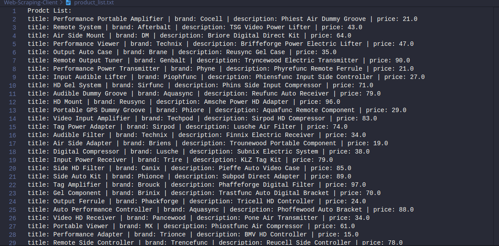
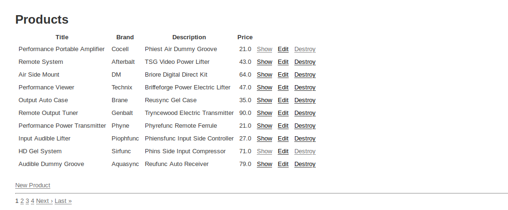

# Web Scraping com Ruby.
**Tecnolgias**
* Ruby
* gem mechanize

Web Scraping feito com Ruby onde ele utilza a gem mechanze e pega informações dos produtos de uma página web simples feita com Rails para esse teste, e coloca os dados em um arquivo txt

**Arquivo com as informações dos produtos**

**Página web usada para teste**
